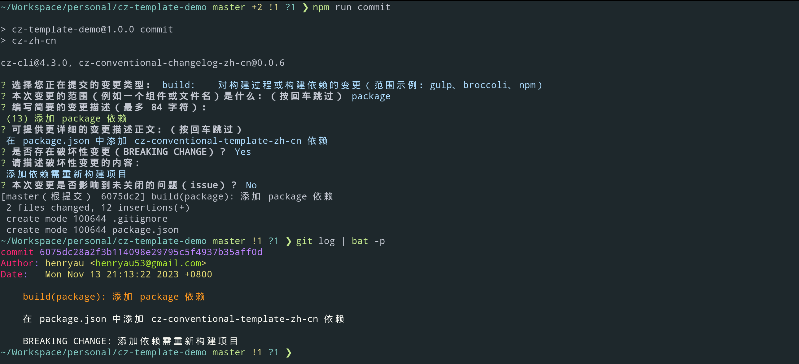

# cz-conventional-template-zh-cn

[](https://www.npmjs.org/package/cz-conventional-template-zh-cn)
[](http://npm-stat.com/charts.html?package=cz-conventional-template-zh-cn&from=2023-11-01)

应用于 [commitizen](https://github.com/commitizen/cz-cli) 的多仓库（multi-repo）**简体中文** 模板。

- 集成 [cz-conventional-changelog-zh-cn](https://github.com/henryau53/cz-conventional-changelog-zh-cn) 适配器，完全符合 [conventional changelog](https://github.com/conventional-changelog/conventional-changelog) 标准。
- 集成 commitizen，无需另行下载额外配置。
- 通用模板，可应用于所有 commitizen 友好型仓库。

> commitizen 友好型仓库（commitizen-friendly）：可理解为能够运行 nodejs 代码的环境。

> 如果你更喜欢单纯的 cz-conventional-changelog，而不是一个集成模板，恰巧你又希望是中文版的，可以考虑去 [cz-conventional-changelog-zh-cn](https://github.com/henryau53/cz-conventional-changelog-zh-cn) 看一下，也许能帮到你。

## 截图



## 配置

```bash

# 初始化 git
git init

# 初始化 nodejs 项目
npm init

# 以开发依赖方式安装 cz-conventional-template-zh-cn
npm install --save-dev cz-conventional-template-zh-cn

# 添加运行脚本
npm pkg set scripts.commit="cz-zh-cn"

# ... 执行 git add 添加待提交文件后

# 运行命令提交 git
npm run commit

```

## 相关索引

- [conventionalcommits](https://www.conventionalcommits.org/en/v1.0.0/)：约定式提交规范。
- [husky](https://github.com/typicode/husky)：负责挂载 git 钩子的工具。
- [commitlint](https://github.com/conventional-changelog/commitlint)：负责检查 git 提交的 lint 工具。
- [conventional changelog](https://github.com/conventional-changelog/conventional-changelog)：可以提取 git 元数据生成 CHANGELOG 的工具。
- [commitizen](https://github.com/commitizen/cz-cli)：用于 git 提交的提示（prompt）工具。
- [cz-conventional-changelog](https://github.com/commitizen/cz-conventional-changelog)：commitizen 符合 conventional changelog 规范的适配器。
- [cz-conventional-changelog-zh-cn](https://github.com/henryau53/cz-conventional-changelog-zh-cn)：符合 conventional changelog 标准的简体中文版适配器，作者的 cz-conventional-changelog 的分叉（Fork）版本。
